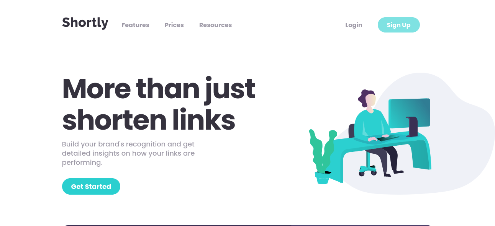
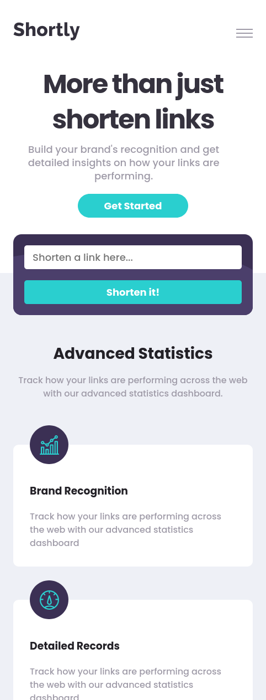

# Frontend Mentor - Shortly URL shortening API Challenge solution

This is a solution to the [Shortly URL shortening API Challenge challenge on Frontend Mentor](https://www.frontendmentor.io/challenges/url-shortening-api-landing-page-2ce3ob-G). Frontend Mentor challenges help you improve your coding skills by building realistic projects. 

## Table of contents

- [Overview](#overview)
  - [The challenge](#the-challenge)
  - [Screenshot](#screenshot)
  - [Links](#links)
- [My process](#my-process)
  - [Built with](#built-with)
  - [What I learned](#what-i-learned)
  - [Continued development](#continued-development)
- [Author](#author)

## Overview

### The challenge

Users should be able to:

- View the optimal layout for the site depending on their device's screen size
- Shorten any valid URL
- See a list of their shortened links, even after refreshing the browser
- Copy the shortened link to their clipboard in a single click
- Receive an error message when the `form` is submitted if:
  - The `input` field is empty

### Screenshot

### Links

- Solution URL: [https://github.com/Vieira14N/url-shortening-page](https://github.com/Vieira14N/url-shortening-page)
- Live Site URL: [https://url-shortening-page-seven.vercel.app/](https://url-shortening-page-seven.vercel.app/)

## My process

### Built with

- Semantic HTML5 markup
- CSS custom properties
- Flexbox
- CSS Grid
- [React](https://reactjs.org/) - JS library
- Shrtcode API

### What I learned

When I started this challenge, I thought it'd be easy to develop with pure JS, so I choose React to challenge myself. I did a React course last year, after finishing it I didn't continue practicing, so I had to remender everything from React. So, I used react components, just that. I tried to apply some hooks, but I have to learn more about it and understand more how react words in the backstage. 

### Continued development

- More abour React
- React Hooks
- Redux

## Author

- Frontend Mentor - [@yourusername](https://www.frontendmentor.io/profile/vieira14n)

